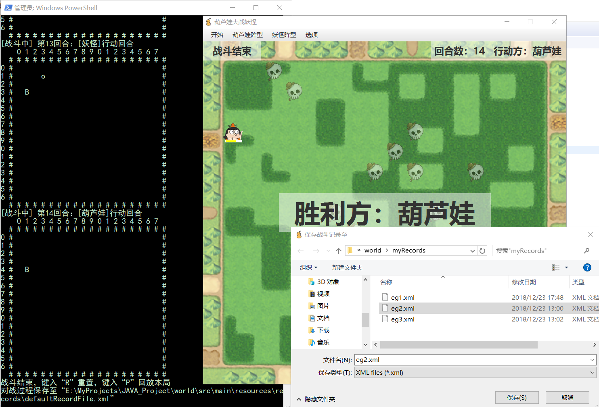

# 葫芦娃大战妖怪 （World_final 最终版）


## 游戏机制

- **每按下空格键，游戏进行半个回合**（一个回合指的是葫芦娃和妖怪各行动一次）


### 1. 场地与阵型

- 17行，18列的二维空间
- 初始化时，葫芦娃在**左侧**布阵，妖怪在**右侧**布阵
- 阵型无论葫芦娃和妖怪都有8种
- 每次转换阵型，所有人物实体的状态（如血量等）重置


### 2. 人物实体

- 共11种实体，除了小喽啰对象个数与阵型相关，其他实体仅有一个对象

- 包括：葫芦娃老大到老七、老爷爷、小喽啰、蝎子精、蛇精

- 移动：

  - 每个实体都可以向8个方向移动（4正4斜角）
  - 移动的距离随机，但不能超过该实体的最大移动距离（定义于 CreatureType）
  - 每次移动不得与活着的人物或者人物死去后留下的骷髅重叠
  - 移动的计算机制：
    —— 每个实体的移动必须**有利于自己的攻击**以及有利于**远离敌人的攻击**
    - 相关方法：void **setRandomDirection**(boolean **keepDistance**, int **minDistance**)
      - keepDistance 是否与敌方保持距离
      - minDistance 若保持距离，最小距离多少
    - 对于**近身攻击**类型（“勇敢地上吧，兄弟”），keepDistance = false
      - 如果距离自己最近的敌方在攻击范围之外，则尽可能接近对方
      - 如果距离自己最近的敌方在攻击范围内，则在保持其在攻击范围内的情况下随机移动
    - 对于**远程攻击**类型（“让我们快乐地放风筝”），keepDistance = true，minDistance = md
      - 如果距离自己最近的敌方在攻击范围之外，则移动：
        - 若敌方太远无法进入攻击范围，则尽可能接近
        - 若可以，则使敌方在攻击范围之内，minDistance 之外
      - 如果距离自己最近的敌方在攻击范围之内，则移动以保证敌方在攻击范围之内，minDistance 之外，这样就可以保持距离来“放风筝”

- 攻击：

  - 每个活着的实体都可以对一定范围内的一定数量的活着的敌方实体发动攻击

  - “范围”即特定实体的最大攻击范围（定义于 CreatureType）

  - “数量”即特定实体的最大攻击数量（定义于 CreatureType）

  - 被攻击敌方的剩余血量即原血量减阵型加成的攻击伤害值（定义于 CreatureType, FormationType）

    因为妖怪阵型有的数量多，有的数量少，乘以一个阵系数来降低小喽啰多的阵型中每个妖怪的攻击力，有利于维持游戏平衡

    若某实体对象剩余血量小于等于0，则视为死亡，该对象变成骷髅留在场中

  - 战斗公式书：

  |        | 类型 | 动画效果 | 特效 | 血量 | 攻击力 | 攻击数量 | 攻击范围 | 移动距离 |
  | :----: | :--: | :------: | :--: | :--: | :----: | :------: | :------: | :------: |
  |  老大  | 近战 |   闪烁   |  无  | 180  |   30   |    2     |    2     |    3     |
  |  老二  | 远程 |   射线   |  无  |  80  |   10   |    4     |    7     |    1     |
  |  老三  | 近战 |   闪烁   |  无  | 150  |   40   |    1     |    1     |    5     |
  |  老四  | 远程 |  能量球  |  无  | 120  |   30   |    2     |    6     |    1     |
  |  老五  | 中距 |   涟漪   |  有  | 120  |   15   |    3     |    3     |    2     |
  |  老六  | 近战 |   闪烁   |  有  | 150  |   60   |    1     |    2     |    7     |
  |  老七  | 中距 |   射线   |  无  | 120  |   40   |    1     |    3     |    2     |
  | 老爷爷 | 近战 |   涟漪   |  无  | 100  |   10   |    4     |    2     |    1     |
  | 小喽啰 | 近战 |  能量球  |  无  | 120  |   15   |    2     |    2     |    3     |
  | 蝎子精 | 中距 |   射线   |  无  | 180  |   50   |    1     |    4     |    2     |
  |  蛇精  | 中距 |   涟漪   |  有  | 150  |   35   |    4     |    4     |    2     |


  - 部分实体的攻击带有**附加效果**（上表的“特效”）：
    - 葫芦娃老五绝招特殊效果：血量分配，平均范围内友方血量并综合加10点血量，触发概率0.8
    - 葫芦娃老六的绝招特殊效果：吸血，恢复敌方剩余血量 50% 的血量，附加伤害 20%
    - 蛇精绝招特殊效果，范围内治愈10点血量，包括自己


### 3. 胜负判定

- 当场地上仅剩下同一阵营的实体，判定该阵营获胜


### 4. 游戏模式

- 模式分为**战斗状态**以及**回放状态**
- 状态分为**准备**（未开始）、**进行中**和**结束**
- 战斗模式是新一轮战斗，移动和攻击是随机、不可预测的
- 回放模式则是读取一个战斗记录文件，回放某一次战斗过程
- 当前模式和状态显示于窗口左上角的标签
- 当前回合数和行动方显示于窗口右上角的标签


### 5. 键盘控制

- **空格键**：使游戏进行半个回合（无论是战斗模式还是回放模式）
  - 有效条件：仅仅在**一轮动画播放完成后才有效**，即在动画播放过程中按下空格键是没有效果的
- **L键**：读取指定名称的 xml 文件
  - 有效条件：（1）[回放]模式，（2）[战斗]模式的[准备]或[结束]
  - 效果：显示文件对话框让用户选择一个 xml 文件，读取战斗过程
- **S键**：将战斗过程另存为指定名称的 xml 文件
  - 有效条件：[战斗]模式的[结束]
  - 效果：显示文件对话框，将战斗过程另存为指定名称的 xml 文件
- **R键**：直接重置到初始状态
  - 有效条件：任何时刻有效
  - 效果：重置到葫芦娃的长蛇阵与妖怪的鹤翼阵
- **P键**：在战斗结束之后直接回放本次战斗
  - 有效条件：[战斗]模式的[结束]
  - 效果：直接进入[回放]\[准备]，开始回放本局战斗


### 6. 菜单栏

- 开始菜单包括：重置、保存为、读取
  - 重置：
    - 有效条件和效果同键盘事件“**R**”
  - 保存为：
    - 有效条件：同键盘事件 “**S**”
    - 效果：同键盘事件 “**S**”
  - 读取：
    - 有效条件：任何时刻有效
    - 效果：同键盘事件 “**L**”
- 葫芦娃菜单包括：8种阵型（葫芦娃版）
  - 有效条件：[战斗]模式
  - 效果：改变葫芦娃阵型到所选阵型的同时重置妖怪阵型
- 妖怪菜单包括：8种阵型（妖怪版）
  - 有效条件：[战斗]模式
  - 效果：改变妖怪阵型到所选阵型的同时重置葫芦娃阵型
- 选项菜单包括：显示动画
  - 有效条件：任何时刻有效
  - 效果：选中状态则显示每回合的动画；不选中状态则不显示动画


## 代码说明

项目结构如下：


- src/main/resources/records 中保存的是一些默认xml文件，不供用户使用
  - defaultRecordFile.xml 是在每局战斗结束后，战斗记录的默认保存位置，即使用户不使用“L键”另存为到其他位置，该局记录总在 defaultRecordFile.xml 中有一个备份
  - JUnitTestRecord.xml 仅仅由于 JUnit 的测试类 XMLRecordReader 中测试文件读取
- myRecords 则是用户的保存战斗记录的位置，每次调用文件选择器就会默认打开这个目录


### cn.AldebaRain.world —— 核心


- **Global**：定义了全局静态常量、全局变量和全局方法

  - 包括：定值，特殊位置，当前状态，文件存取，是否播放动画等

- **Main**：JavaFX 应用

  - 加载应用窗口、显示文件选择器等

- **CoreWorld**：终端打印世界（每半回合打印一次）

  - 重要属性：

    ```java
    	/**	定义葫芦娃阵型对象，用于对实体的初始化	*/
    	public static Formation broForm;
    	/**	定义妖怪阵型对象，用于对实体的初始化	*/
    	public static Formation monForm;
    	/**	全部实体对象	*/
    	public static Map<Integer, Entity> entities = new HashMap<>();
    ```


### cn.AldebaRain.world.entities —— 实体


- 核心方法 —— 多线程的实现（**run()** 与 **start()**）

  ```java
  public class Entity implements Runnable {
      ...
  	/**	开启线程	*/
  	public void start() {
      	thread = new Thread(this);
      	thread.start();
  	}
  	@Override
  	public void run() {
  		synchronized (CoreWorld.entities) {
  			// 先判断战斗是否结束以及本实体对象是否死亡
              ...
  			attack(); // 攻击
  			trymove(); // 移动
  			position.reset(position.mov(direction));
  			GUIWindow.threadCountDown.countDown(); // 倒计时
  			return;
  		}
  	}
  }
  ```

- 所有子类继承接口实现 **trymove()** 和 **attack()** 方法，而同时**覆盖**父类的这两个方法，这样父类的引用就能调用子类的方法，实现了**多态**

  - **trymove()** 方法中，不同实体类调用参数不同的方法 **setRandomDirection**(boolean keepDistance, int minDistance) 以计算下一步的移动位置

  - **attack()** 方法中，父类中先调用 getAttackTargets() 方法获取本次攻击对象，然后计算攻击值（该实体攻击力 * 阵型修正系数），用敌方血量减去攻击值获得敌方剩余血量，最后子类中调用默认方法 startAttackSideEffect() 计算附加效果

    ```java
    public class Entity implements Runnable {
        ...
    	public void attack() { 
    		getAttackTargets();
    		for (Entity en: targetSet) {
    			double bonus = 1; // 阵型修正系数
    			if (creatureType.group() == GroupType.Bro)
    				bonus = CoreWorld.broForm.getType().broAtkBonus;
    			else bonus = CoreWorld.monForm.getType().monAtkBonus;
    			// 敌方剩余血量
    			int restBlood = (int)(en.blood - bonus * creatureType.attackPower);
    			if (restBlood <= 0) {
    				en.blood = 0;
    				en.state = EntityState.DEAD;
    			}
    			else en.blood = restBlood;
    		}
    	}
    }
    ```

- 在接口 EntityAction 中的默认方法可以实现实体攻击的附加效果：

  ```java
  	/**	攻击的副作用，默认没有，只有部分实体有	*/
  	public default void startAttackSideEffect() {
  		return;
  	}
  ```

  该方法仅在 EntityBro5、EntityBro5、EntitySnk 这些有附加攻击效果的实体的类中实现：

  ```java
  public class EntitySnk extends Entity implements EntityAction {
      ...
  	/**	重写父类方法	*/
  	@Override
  	public void attack() {
  		super.attack();
  		startAttackSideEffect();
  	}
  	/**	蛇精绝招的特殊效果，范围内治愈10点，包括自己	*/
  	@Override
  	public void startAttackSideEffect() { ... }
  }
  ```


### cn.AldebaRain.world.formations —— 阵型


- 阵型的属性 Map<Point, CreatureType> formMap 是阵型内每个实体与其位置的一一对应

- 每个子类的不同来自其各自的构造函数中，在 formMap 里放入了不同的 <Point, CreatureType> 对：

  ```java
  // 在这里以鱼鳞阵为例
  public final class YuLin extends Formation {
  	public YuLin(GroupType ct) { // 阵营
  		super(FormationType.YL); // 构建
  		if (ct == GroupType.Bro) {
  			init(5, 4, 2, 1); // 阵型图所占行列
  			// 葫芦娃的位置
  			formMap.put(new Point(2, 0), new Elder()); // 老爷爷
  			formMap.put(new Point(0, 1), new Brothers(0));
  			formMap.put(new Point(1, 1), new Brothers(1));
              ...
  		}
  		else {
  			init(7, 5, 3, 2); // 阵型图所占行列
  			// 妖怪的位置
  			formMap.put(new Point(3, 2), new Scorpion()); // 蝎子精
  			formMap.put(new Point(3, 4), new Snake()); // 蛇精
  			formMap.put(new Point(4, 3), new Monsters());
  			formMap.put(new Point(6, 3), new Monsters());
              ...
  		}
  	}
  }
  ```


### cn.AldebaRain.world.gui —— GUI

- 采用 **JavaFX**，并使用 **SceneBuilder** 设定界面的 **FXML** 文件

  - **GUIBorder** 类对应于文件 **WorldBorder.fxml**
    其主要作用是，定义了菜单栏/菜单项，和与菜单相关的操作/行为

  - **GUIWindow** 类对应于文件 **WorldWindow.fxml**

    其分为5层：

     *	最底层（@FXML private Label background）
          只有一个Label，用来显示**背景图片**
     *	次底层（@FXML public GridPane attackLayer）
          是**战斗动画的显示层**，绘制各种攻击图形和动画
     *	中间层（@FXML public GridPane animLayer）
          是**人物的显示层**，用来绘制人物Label以及显示移动动画
     *	次顶层（@FXML public GridPane bloodLayer）
          是**血量条的显示层**，在每个人物上方绘制血量条并伴随人物移动
     *	最顶层（Label modeLabel/groupLabel/roundLabel/observer/TextField receiver）
          是**说明标签层**，用来显示当前状态（战斗/回放、哪一方胜利）以及接受键盘输入

- **GUIWindow —— 动画 + 键盘**

  - 初始化

    ```java
        @FXML
        private void initialize() {
        	// 初始化背景
        	Image backImg = new Image(getClass().getClassLoader().getResourceAsStream("img/BackGround.png"));
        	background.setGraphic(new ImageView(backImg));
        	// 初始化说明标签
        	initLabels(false);
        	// 初始化animItems/BloodItems（人物标签/血量条）
    		initAnimItems();
    		initBloodItems();
    		animLayer.setVisible(true);
    		Global.hasAnimation = true; // 全局变量，表示播放动画
    		// 设置键盘事件
    		receiver.setOnKeyReleased(new EventHandler<KeyEvent>() {
                @Override
                public void handle(KeyEvent event) {
                    if (event.getCode() == KeyCode.SPACE && cWrd != null) { pressKeySpace(); }
                    if (event.getCode() == KeyCode.L && cWrd != null) { pressKeyL(); }
                    if (event.getCode() == KeyCode.S && cWrd != null) { pressKeyS(); }
                    if (event.getCode() == KeyCode.R && cWrd != null) { pressKeyR(); }
                    if (event.getCode() == KeyCode.P && cWrd != null) { pressKeyP(); }
                }
            });
        }
    ```

  - 核心功能 —— 空格键继续功能（**pressKeySpace()** 方法）

    ```java
    	private void pressKeySpace() {
    		Global.battleStart = true;
    		if (!Global.battleEnd) { // 战斗未结束
    	    	// 回合数加1（从“第1回合”开始），显示描述信息
    			Global.roundNum += 1; 
    			showRoundDescription(); // 打印回合数信息到控制台以及显示到Label
    			// 新建动画时间轴
    			timeline = new Timeline();
    	        timeline.setCycleCount(1);
    	        // 给子线程一个倒计时
    	        int threadNum = CoreWorld.entities.size(); // 子线程个数
    	        threadCountDown = new CountDownLatch(threadNum);
    			// 行动（一群子进程开启，或读文件不开启子进程）
    	        start(); 
    			// 只有所有子进程执行结束后才执行动画和打印操作
    			try {
    				// 等待所有子线程
    				threadCountDown.await(5, TimeUnit.SECONDS); // 5秒超时
                    // 若菜单栏选择播放动画
    				if (Global.hasAnimation) { 
    					// 先控制输入，防止在动画期间键入空格
    	    			timeline.getKeyFrames().add(new KeyFrame(Duration.millis(0),
    	    					new KeyValue(receiver.disableProperty(), true)
    	    					));
    	    			timeline.getKeyFrames().add(new KeyFrame(Duration.millis(Global.atkDurTime + Global.movDurTime),
    	    					new KeyValue(receiver.disableProperty(), false)
    	    					));
    					// 设置动画
    					setAttackAnimation(); // 攻击动画
    					setMoveAnimation(); // 移动动画
    					setFadeAnimation(); // 死亡动画
    					// 开始播放
    			        timeline.play(); 
    				} else { // 菜单栏选择不播放动画
    					setBlood(); // 无动画改变血量
    					setMove(); // 无动画移位
    					setDead(); // 无动画改图像为骷髅
    				}
    		        // 开始打印
    				cWrd.showWorld();
    				Global.keepFormationRound -= 1;
    				// 临时存储
    				if (!Global.battlePlayingBack) // 回放模式不存储
    					Global.recordWriter.addRoundElements(Global.roundNum); 
    				Global.battleEnd = Global.isEnded();
    				// 如果战斗/回放[结束]
    				if (Global.battleEnd) {
    					observer.setText("  胜利方：" + Global.battleWin.label + "  ");
    					observer.setVisible(true);
    					if (Global.battlePlayingBack) { // 回放模式不存储
    						System.out.println("回放结束，键入“R”重置");
    						modeLabel.setText("回放结束");
    					}
    					else { // 导出到默认文件
    						System.out.println("战斗结束，键入“R”重置，键入“P”回放本局");
    						modeLabel.setText("战斗结束");
    						Global.recordWriter.saveRecord(Global.defaultFile);
    					}
    				}
    			} catch (InterruptedException e) {
    				e.printStackTrace();
    			}
    		}
    	}
    ```

  - 核心方法 —— GUIWindow 的上述方法中的 **start()** 方法

    ```java
    	/**	战斗模式开启所有实体的线程或回放模式读取文件不开启线程
    	 *	线程倒计时	*/
    	public void start() {
            // 通过回放或线程改变所有实体对象的运动属性
    		for (Entity en: CoreWorld.entities.values()) {
    			if (Global.battlePlayingBack) { // 回放模式
    				Global.recordReader.setEntityByRound(en, Global.roundNum);
    				threadCountDown.countDown(); // 倒计时
    			}  
                else if (Global.isActionRound(en.creatureType.group()))
    				en.start(); // 若是战斗模式且是本实体行动回合，开启线程，内部有倒计时
    			else { // 否则静止
    				en.direction.reset(0, 0); 
    				en.targetSet.removeAll(en.targetSet);
    				threadCountDown.countDown(); // 由于初始化的线程个数包括了非行动回合实体，因此需要减一下
    			}
    		}
    	}
    ```

- **GUIBorder —— 菜单**

  - 以重置和是否显示动画这两个菜单项为例

    初始化：

    ```java
        @FXML
        private void initialize() {
        	menuItReset.setOnAction((ActionEvent t) -> {
        		handleReset();
            });
            ...
        	menuCheckAnim.setSelected(true);
        	menuCheckAnim.setOnAction((ActionEvent t) -> {
        		handleSetAnim();
            });
        /**	菜单项 —— 重置	*/
    	private void handleReset() {
    		if (cWrd != null && gWin != null) 
    			gWin.pressKeyR(); // 恰好与键盘事件相同，直接调用
    	}
        /**	菜单项（可选） —— 显示动画	*/
    	private void handleSetAnim() {
    		if (menuCheckAnim.isSelected()) 
    			Global.hasAnimation = true;
    		else 
    			Global.hasAnimation = false;
    	}
    ```


### cn.AldebaRain.world.util —— 枚举等工具类


- **EntityState**：实体对象状态（生 **LIVE** 或死 **DEAD**）

- **AttackType**：定义了攻击动画的效果

  | AttackType  |  攻击方式  |            动画效果            |
  | :---------: | :--------: | :----------------------------: |
  |  **Knock**  |  近身攻击  |         敌方带颜色闪烁         |
  | **Radiate** |  射线攻击  |     向敌方发射一道彩色射线     |
  |  **Fire**   | 能量球攻击 |    向敌方发射一个彩色能量球    |
  |   **Aoe**   |  范围攻击  | 以自己为中心产生一个圆形“涟漪” |

- **GroupType**：定义了两大阵营（葫芦娃阵营 **Bro** 或妖怪阵营 **Mon**）

- **FormationType**：阵型类型（**HY**("鹤翼阵"), **YX**("雁行阵"), **CE**("冲轭阵"), **CS**("长蛇阵"), **YL**("鱼鳞阵"), **FY**("方円阵"), **YY**("偃月阵"), **FS**("锋矢阵")）

  - 同时定义了每个阵型的威力修正系数：
    防止有些阵型（例如妖怪的偃月阵）小喽啰太多导致的不平衡问题，实际上该阵型中妖怪的攻击力乘上了修正系数 0.4，使游戏更加平衡

    |  阵型  | 葫芦娃阵型修正系数 | 妖怪阵型修正系数 |
    | :----: | :----------------: | :--------------: |
    | 鹤翼阵 |        1.0         |       1.0        |
    | 雁行阵 |        1.0         |       1.0        |
    | 冲轭阵 |        1.0         |       1.0        |
    | 长蛇阵 |        1.0         |       1.0        |
    | 鱼鳞阵 |        1.0         |       0.85       |
    | 方円阵 |        1.0         |       1.0        |
    | 偃月阵 |        1.0         |       0.4        |
    | 锋矢阵 |        1.0         |       0.7        |

- **CreatureType**：生物类别，同时定义了每个类别生物的“公式书”

  - 包括：(1) 变量：控制台打印符号，GUI 对应图片名称；
    ​	    (2) 变量：血量，攻击力，攻击数量，攻击范围，移动范围；
    ​	    (3) 方法：返回对应 AttackType、攻击动画颜色、创建并返回对应 Entity 对象等

  

  ```java
  	/**	@return 对应的阵营 */
  	public GroupType group() {
  		switch (this) {
  		case Mons: case Scorp: case Snk: return GroupType.Mon;
  		default: return GroupType.Bro;
  		}
  	}
  	/**	@return 攻击类型	*/
  	public AttackType attackType() {
  		switch (this) {
  		case Bro1: case Bro3: case Bro6: return AttackType.Knock;
  		case Bro2: case Scorp: case Bro7: return AttackType.Radiate;
  		case Bro4: case Mons: return AttackType.Fire;
  		default: return AttackType.Aoe;
  		}
  	}
  	/**	@return 攻击颜色	*/
  	public Color attackColor() {
  		switch(this) {
  		case Bro1: return Color.RED;
  		case Bro2: return Color.WHEAT;
  		case Bro3: return Color.GOLD;
  		case Bro4: return Color.ORANGERED;
  		case Bro5: return Color.CORNFLOWERBLUE;
  		case Bro6: return Color.AQUAMARINE;
  		case Bro7: return Color.PLUM;
  		case Eld: return Color.LIGHTGREEN;
  		case Snk: return Color.LIGHTGRAY;
  		case Scorp: return Color.PURPLE;
  		default: return Color.DEEPPINK;
  		}
  	}
  	/**	@param ctype 生物种类
  	 *	@param bia 该生物在阵型内的偏移
  	 *	@param p 该生物在世界地图的位置
  	 *	@return 实体对象 */
  	public Entity getEntity(Point bia, Point p) {
  		switch (this) {
  		case Bro1: return new EntityBro1(bia, p);
  		case Bro2: return new EntityBro2(bia, p);
  		case Bro3: return new EntityBro3(bia, p);
  		case Bro4: return new EntityBro4(bia, p);
  		case Bro5: return new EntityBro5(bia, p);
  		case Bro6: return new EntityBro6(bia, p);
  		case Bro7: return new EntityBro7(bia, p);
  		case Eld: return new EntityEld(bia, p);
  		case Scorp: return new EntityScorp(bia, p);
  		case Snk: return new EntitySnk(bia, p);
  		default: return new EntityMons(bia, p);
  		}
  	}
  ```


### cn.AldebaRain.world.xml—— 文件存取


- **XMLRecordStructure**

  - 定义了与 xml 文件的读写相关的静态常量和静态函数

    战斗记录的xml文件形如：

    ```xml
    <records>
        ...
    	<entity1126 ctype="Eld" r="11" c="4">
    		<round1 state="LIVE" hp="100" posr="11" posc="5" dr="0" dc="1"/>
            ...
    		<round7 state="LIVE" hp="85" posr="10" posc="7" dr="1" dc="0">
    			<target tid="2073"/>
    		</round7>
            ...
    		<round13 state="LIVE" hp="55" posr="10" posc="8" dr="-1" dc="1">
    			<target tid="2020"/>
    			<target tid="2111"/>
    		</round13>
    	</entity1126>
    	<entity2054 ctype="Scorp" r="7" c="12">
            ...
    	</entity2054>
        ...
    </records>
    ```

- **XMLRecordWriter** 

  - 实现战斗记录**保存为 xml 文件**

  - 保存战斗记录的机制有两个：

    （1）**自动保存**：每进行半个回合（即每单击键盘空格）保存一次
    ​			     本局[结束]后自动保存文件到 **Global** 类定义的默认地址 **defaultFile()**：

    ```java
    public class Global {
        ...
    	/**	默认保存文件	*/
    	public static final File defaultFile = getFile("src/main/resources/records/defaultRecordFile.xml", "tmp");
    	/**	辅助获取默认文件位置	*/
    	public static final File getFile(String root, String alt) {
    		File myFile = new File(root);
    		if (!myFile.exists()) { // 说明是maven路径
    			String myPath = (new File("")).getAbsolutePath();
    			myPath = myPath.substring(0, myPath.length() - 6);
    			System.out.println(myPath);
    			myFile = new File(myPath + root);
    		}
    		if (!myFile.exists()) { // 说明jar被换地方了
    			myFile = new File(alt);
    			myFile.mkdirs();
    		}
    		return myFile;
    	}
    }
    ```

    这样就能够实现战斗结束后，不使用文件选择器选择文件，直接回放本局战斗的功能。

    （2）**手动保存**：在[战斗]模式下，本局[结束]状态，按 **S** 键或点击菜单栏“**开始 -> 保存为**”打开文件选择器，将战斗过程另存为指定名称的 xml 文件，即：

    ```java
    	public void saveRecord(File file) {
    		try{
    			// 创建XmlWriter对象
                XMLWriter writer = new XMLWriter(OutputFormat.createPrettyPrint());
                FileOutputStream fos = new FileOutputStream(file);
                writer.setOutputStream(fos);
                // 导出
                writer.write(doc);
                System.out.println("对战过程保存至“" + file + "”");
                writer.close();
            } catch(Exception e){
                e.printStackTrace();
            }
    	}
    ```

  - [**准备**]状态，需要根据 Map<Integer, Entity> **entities** 集合的值，添加每一个实体对象对应的 entity\*\*\*\* 节点（\* 代表该实体对象的 id 号），调用方法 **addEntityElements()**

  - [**进行中**]状态，**每单击空格键调用 start()** 之后，都要保存一次节点，即在每个 entity\*\*\*\* 节点下添加一个 round\* 节点（\* 代表回合数），调用方法 **addRoundElements(int n)** 

  - 这样就实现了从【每半个回合更新一次的 Map<Integer, Entity> **entities** 集合】到【拥有所有实体对象的每个回合情况的一群节点】的转换

- **XMLRecordReader** 

  - 实现战斗记录 **xml 文件的读取**

  - 在构造函数中直接读取 xml 文件，获得根元素

    ```java
    	public XMLRecordReader(File file) {
    		super();
    		try {
    			// 使用SAXReader读取文档
    			SAXReader reader = new SAXReader();
    			doc = reader.read(file);
                System.out.println("读取对战过程自“" + file + "”");
    			// 获取根元素
    			root = doc.getRootElement();
    			// 初始化entities集合
    			initEntitiesByElement();
    		} catch (DocumentException e) {
    			e.printStackTrace();
    		}
    	}
    ```

  - 其中方法 **initEntitiesByElement()** 将所有 entity\*\*\*\* 节点的信息转化并写入空的 **entities** 集合

  - 与 XMLRecordWriter 类相反，XMLRecordReader 类实现了从【拥有所有实体对象的每个回合情况的一群节点】到【每半个回合更新一次的 Map<Integer, Entity> **entities** 集合】的转换，即**每单击空格键调用 start()** 之后，都要根据当前回合数的 round\* 节点信息调用方法 **setEntityByRound(Entity en, int n)** 来更新 **entities** 集合


## JUnit 测试类

- 测试 CoreWorld：**CoreWorldTest**
- 测试 XMLRecordReader：**XMLRecordReaderTest**


## Maven 构建

- **Maven Clean**（mvn clean）

  

- **Maven Test**（mvn test）

  

- **Maven Install**（mvn package）

  - 最终在 target 目录产生了两个 jar 包：

    

    其中 original-world.jar 里只包含了工程自己的 class 文件，而 world.jar 包则包含了工程本身以及所有依赖的 jar 包的 class 文件，使用 world.jar，就能在控制台运行本项目：

    


